# RDV AIR – AI Review

    

RDV AIR – ИИ-агент для ревью модулей 1С:Предприятия (1C:Enterprise, BSL) и запросов СКД по номеру задачи или GitLab Merge Request (MR).

[Быстрый старт](#быстрый-старт) · [Как устроено](#устройство-агента-модель-движок-и-yaml-протокол-поведения) · [Запуск из Jira](#запуск-из-jira) · [FAQ](#faq)

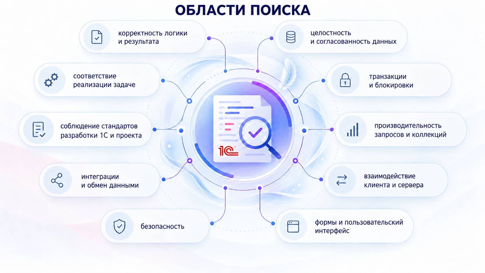

Форматирование, ширина строк, опечатки и другие правила, которые не требуют анализа контекста, остаются за SonarQube и линтерами.

Результат – Markdown-отчёт с замечаниями, обоснованиями, предложениями по исправлению и ссылками на строки GitLab.

| Возможность | Поддержка |
| --- | --- |
| Ревью модулей 1С | ✅ |
| Ревью запросов СКД | ✅ |
| Ревью задачи по номеру | ✅ |
| Ревью GitLab MR | ✅ |
| MCP по стандартам 1С | ✅ |
| MCP по платформе 1С | ✅ |
| MCP по БСП | ✅ |
| Роли и оркестрация | ✅ |
| Два этапа ревью | ✅ |
| Codex | ✅ |
| Cursor | ✅ |
| OpenCode | ✅ |
| Запуск из Jira | ✅ |

## Устройство агента: модель, движок и YAML-протокол поведения

Модель анализирует код и вызывает команды для записи кандидатов, доказательств и решений. Система обновляет структурированный YAML-протокол поведения, проверяет обязательные поля и формирует отчёт.

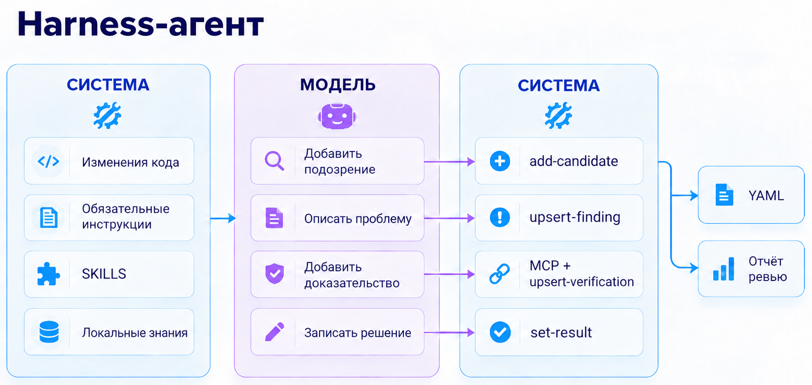

## Два этапа ревью: аудитор и критик

На Stage 1 **аудитор** собирает кандидатов. На Stage 2 **критик** проверяет каждого по коду и источникам, затем подтверждает или отклоняет кандидата.

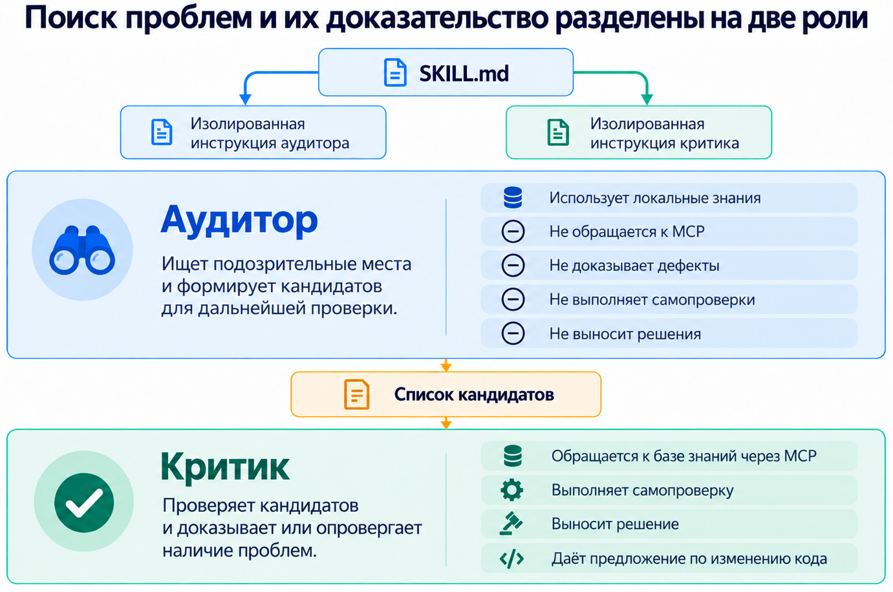

## Оркестрация: один агент или параллельные аудиторы

По умолчанию обе стадии выполняет один агент. Дополнительная инструкция позволяет разделить роли между агентами или запустить параллельных аудиторов по направлениям: производительность, безопасность, конкурентность и др.

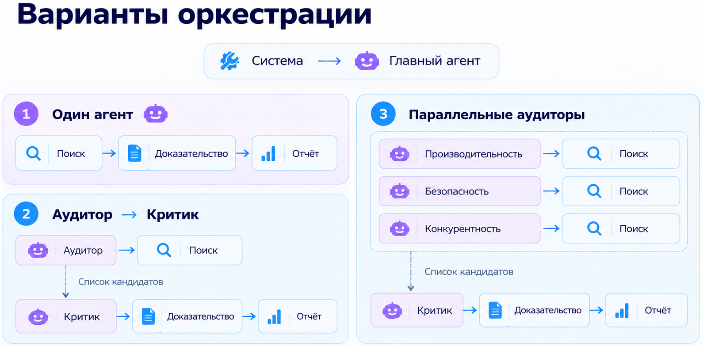

## MCP и локальные знания

Через MCP агент сверяет вывод с документацией платформы, стандартами разработки и БСП, проверяет синтаксис. `metadata.json` даёт агенту метаданные 1С, `indexes.json` – сведения об индексах для проверки запросов. 

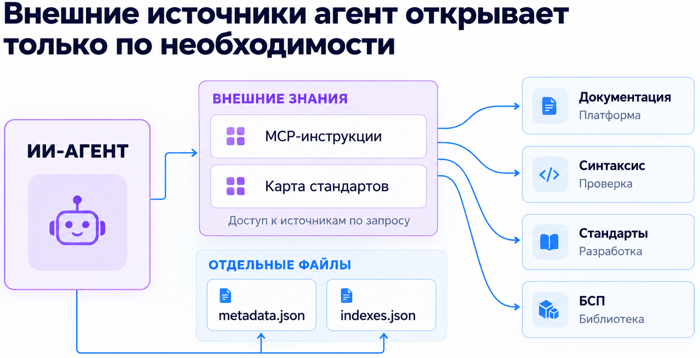

## ИИ-ревью в процессе разработки

Разработчик запускает ревью перед передачей задачи на тестирование, исправляет замечания. Архитектор при необходимости запускает собственного ИИ-агента ревью и проводит ручное ревью.

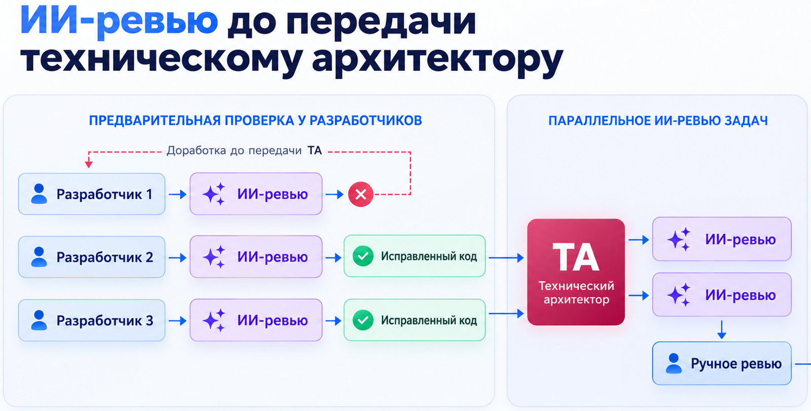

## Ревью кода 1С по номеру задачи или GitLab MR

В TASK-режиме система находит коммиты по номеру задачи в выбранном локальном Git репозитории; альтернативный источник – GitLab MR. Для ревью создаётся каталог с изменённым кодом, контекстом задачи и инструкциями агенту.

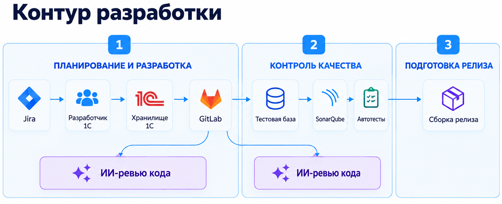

## Запуск из Jira

Ревью запускается одной кнопкой **«Отправить на ревью»** в задаче Jira. Расширение показывает статус и открывает отчёт. В нём же можно передать собственную пользовательскую инструкцию агенту.

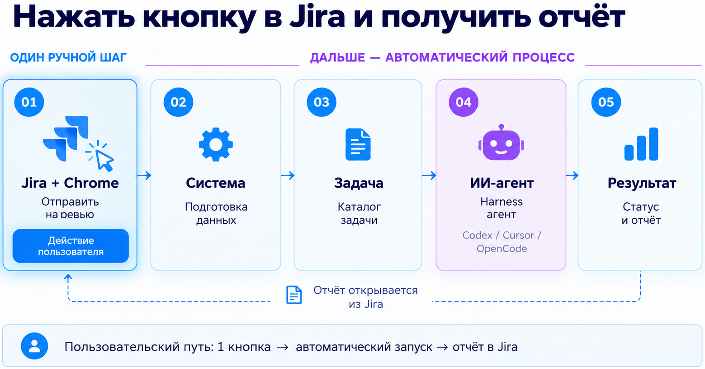

### Пример запуска

Один раз настройте [локальный сервис и расширение Chrome](docs/advanced-usage.md#запускать-ревью-из-jira). После этого:

1. Откройте задачу в Jira и нажмите значок расширения. Оно подхватит ключ, название и статус задачи.

   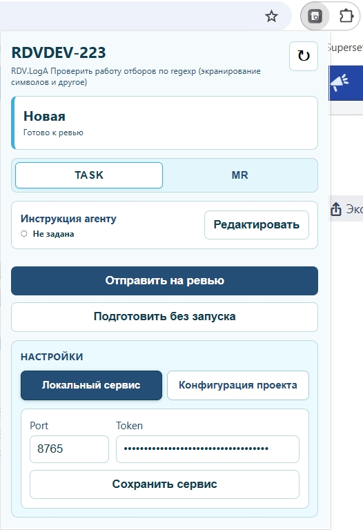

2. На вкладке **Конфигурация проекта** укажите Git-репозиторий, каталог для результатов, базовую ветку, remote, AI-агента и режим MCP. Настройки сохраняются для префикса проекта.

   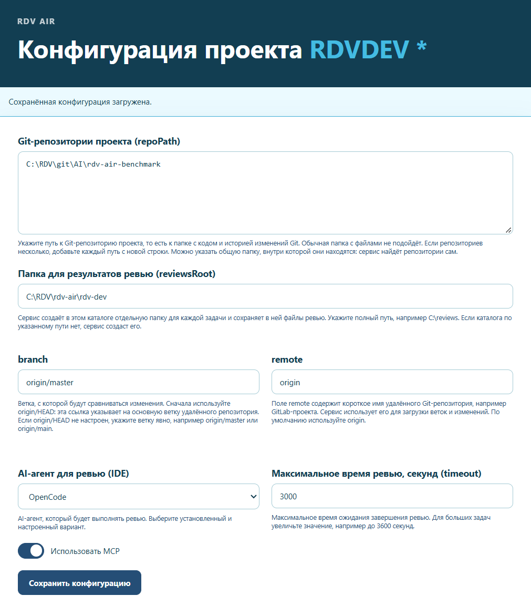

3. При необходимости нажмите **Редактировать** и добавьте инструкцию агенту для этой задачи.

   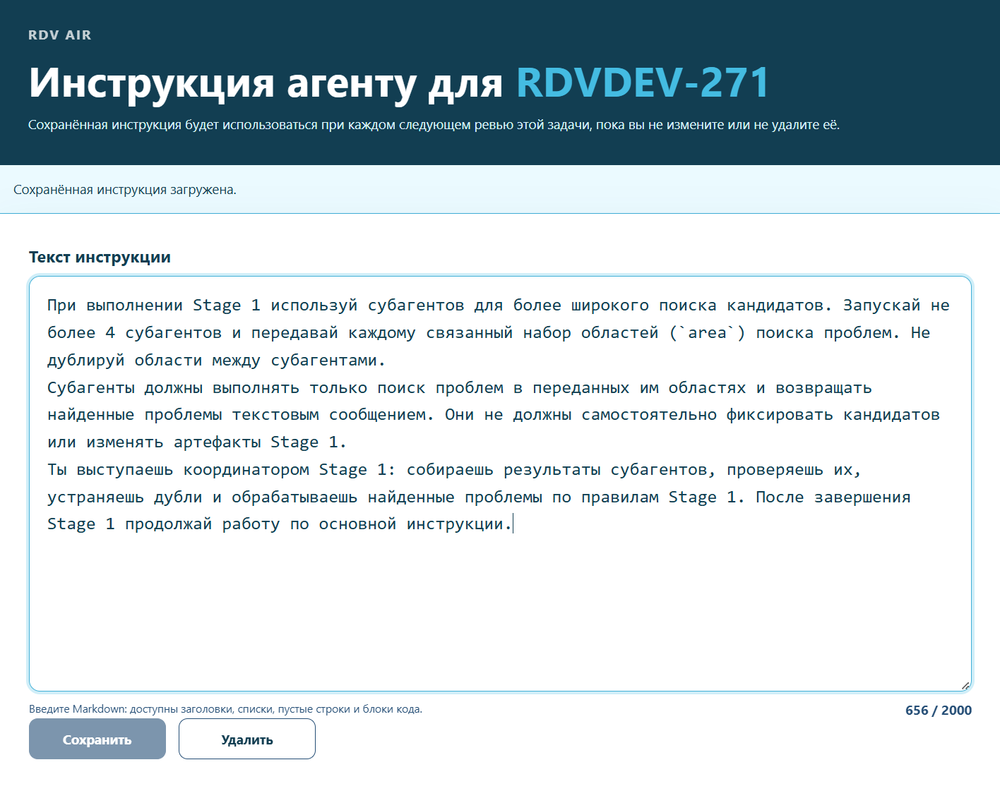

4. Выберите источник изменений: **TASK** ищет коммиты по ключу задачи, **MR** проверяет выбранный GitLab Merge Request. Нажмите **Отправить на ревью**. Кнопка **Подготовить без запуска** создаёт каталог задачи без запуска агента.

   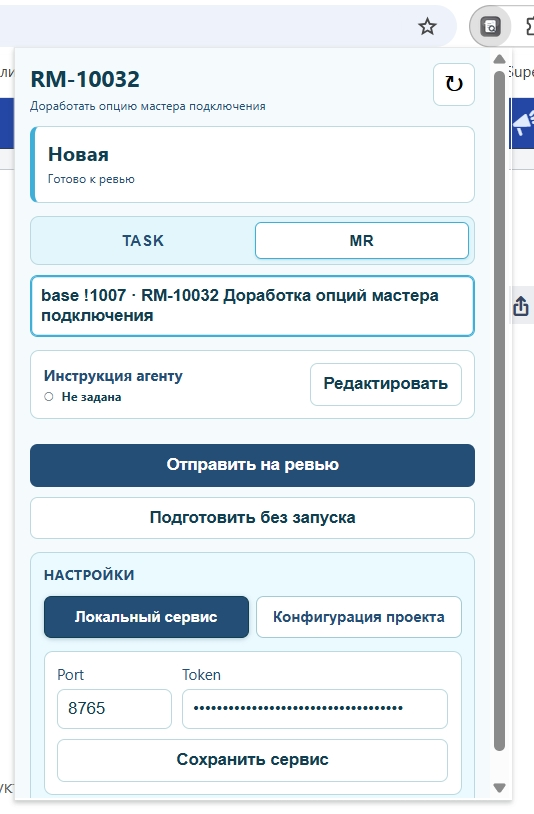

5. После завершения откройте отчёт со сводкой, замечаниями, ссылками на код и предложениями по исправлению кнопкой в расширении.

   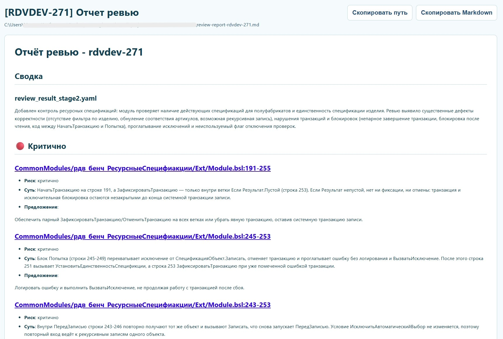

## Быстрый старт

RDV AIR устанавливается как Python-пакет `review-tasks` и запускается одноимённой командой.

Откройте проект в Codex, Cursor, OpenCode или другой IDE и напишите агенту:

> Установи и настрой RDV AIR.

После настройки напишите:

> Проверь изменения по задаче `TASK-123`.

Откройте созданный каталог задачи как отдельную рабочую область и напишите агенту:

> Проведи ревью задачи.

Отчёт появится в файле `review-report-<task>.md`.

[Установка и ручной запуск ревью](docs/advanced-usage.md) · [Запуск ревью из Jira](docs/advanced-usage.md#запускать-ревью-из-jira) · [Диагностика ошибок](docs/troubleshooting.md)

## FAQ

### Модели, MCP и передача кода

**Как подключить облачную или локальную модель?**

Модель настраивается в выбранной IDE (OpenCode, Cursor, Codex). Через OpenCode можно подключить облачного провайдера или локальную модель.

**MCP-серверы уже встроены?**

Нет. В поставке есть коннекторы и правила работы с MCP, а MCP-серверы нужно иметь отдельно.

**Куда передаётся исходный код?**

Агент в процессе ревью передаёт код выбранной модели: облачному провайдеру или в вашу локальную модель.

### Запуск и описание задачи

**Обязательны ли Jira и MCP?**

Нет. Ревью можно запускать вручную без Jira, а MCP отключить.

**Можно запустить автоматически?**

В текущей реализации запускается вручную через IDE или кнопкой в расширении Jira. Но можно автоматизировать запуск.

**Можно передать описание задачи или другую дополнительную информацию агенту?**

Да, через пользовательскую инструкцию агенту. Добавьте требования, ожидаемое поведение и важные детали задачи.

### GitLab, коммиты и ветки

**Как RDV AIR получает изменения из GitLab – через API?**

Через Git, поэтому нужен локальный репозиторий. RDV AIR использует историю коммитов, чтобы получить изменения задачи, собрать контекст кода и получить метаданные 1С из той же версии проекта. Для получения кода отдельный GitLab API-токен не нужен. API используется для поиска MR в расширении Jira.

**Как система понимает, какие коммиты относятся к задаче?**

В режиме TASK ищет ключ задачи, например `TASK-123`, в сообщениях коммитов выбранной ветки. В режиме MR берёт изменения указанного Merge Request.

**Нужна ли отдельная ветка для каждой задачи?**

Нет. Можно проводить ревью в общей ветке проекта, если сообщения коммитов содержат ключ задачи.

**Оставляет ли RDV AIR комментарии в GitLab?**

Пока нет, но это в планах. Сейчас результат – Markdown-отчёт со ссылками на строки GitLab.

## Лицензия

Проект распространяется под лицензией **BSD 3-Clause**. Подробности см. в файле [LICENSE](LICENSE).
