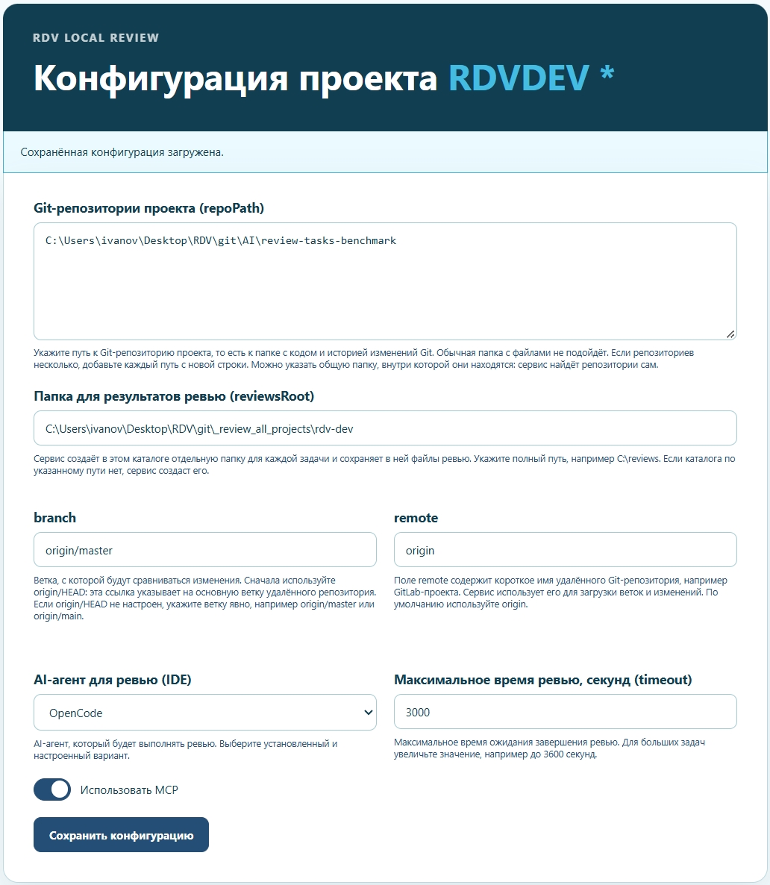
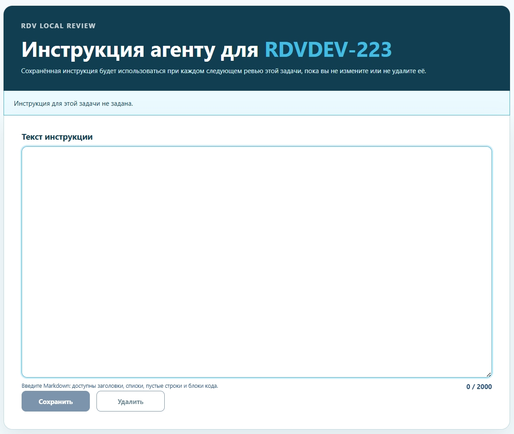

# review-tasks

**Поэтапное AI code review кода 1С по ключу задачи GitLab или GitLab Merge Request.**

`review-tasks` отбирает изменения конкретной задачи, собирает для них отдельный рабочий каталог и проводит агента через Stage 1, Stage 2 и валидацию результата. Итоговый Markdown-отчёт формируется в Codex, Cursor или OpenCode.

Ревью можно запустить вручную из IDE или прямо со страницы Jira. Ручной запуск работает без Jira и внешних MCP-серверов. `review-setup` устанавливает компоненты и полностью настраивает проект, а `review-init` только создаёт каталог для указанной задачи или MR.

[Быстрый старт](#быстрый-старт) · [Как работает ревью](#как-работает-ревью) · [Запуск из Jira](#запуск-из-jira) · [Документация](#документация)

```text
ключ задачи + Git ref                         GitLab MR
          └──────────────┬───────────────────────┘
                         ↓
                review-tasks init
                         ↓
                   каталог задачи
                         ↓
              Stage 1 → Stage 2
                         ↓
                    validation
                         ↓
              review-report-<task>.md

        необязательно: MCP → внешнее подтверждение
```

## Что такое `review-tasks`

`review-tasks` — CLI для подготовки контекста и запуска поэтапного ревью изменений BSL/1С. В TASK-режиме он находит коммиты по ключу задачи в выбранном Git ref. Также можно передать конкретный GitLab MR или найти MR по ключам задач через Git refs.

Проверяемый вход ограничен изменёнными модулями `.bsl` и изменёнными текстами запросов в макетах отчётов СКД. Для каждого запуска создаётся каталог задачи с кодом, контекстом задачи, метаданными, инструкциями, артефактами Stage 1 и Stage 2 и файлами выбранной IDE.

После команды `review-start-task` агент выполняет обе стадии, валидирует структурированный результат и записывает Markdown-отчёт в корень каталога задачи. Расширение Jira и внешняя проверка через MCP подключаются отдельно.

TASK-режим использует Git и не обращается к Jira или GitLab API.

## Зачем разделять ревью на стадии

Обычный разовый запрос к агенту выглядит так:

```text
изменения → один запрос → ответ
```

`review-tasks` фиксирует другой процесс:

```text
изменения задачи
    → подготовленный контекст
    → Stage 1
    → Stage 2
    → validation
    → Markdown-отчёт
```

CLI заранее выделяет изменения задачи и собирает одинаковую структуру входных данных для поддерживаемых IDE. Проверка не заканчивается свободным ответом агента: структурированный результат проходит валидацию, после чего из него формируется отчёт.

## Как работает ревью

1. `init` обновляет refs указанного remote и выбирает источник: TASK или MR.
2. Для TASK он ищет ключ задачи в сообщениях коммитов выбранного ref и формирует контекст только по подходящим коммитам.
3. CLI создаёт отдельный каталог задачи с инструкциями и локальными артефактами Stage 1 и Stage 2.
4. `review-start-task` проверяет готовность каталога, запускает поэтапный процесс, валидирует структурированный результат и рендерит Markdown-отчёт.
5. При `--mcp required` агент может использовать настроенные MCP-серверы для внешнего подтверждения. При `--mcp off` такие каналы помечаются как `unavailable`, а итог внешней проверки — как `limited_unverified`.

## Быстрый старт

Скачайте ZIP публичной ветки `main` или клонируйте её. Откройте папку `review-tasks` в Codex, Cursor или OpenCode: так IDE обнаружит skills проекта из `.agents/skills`.

### 1. Запустить установку проекта: `review-setup`

Запустите skill с коротким запросом:

> Установи и настрой `review-tasks`.

Skill проверит готовые компоненты и после согласия установит недостающие: Python, Git, CLI и выбранный AI-агент. Затем он получит или клонирует репозиторий проверяемого проекта, проверит SSH/remote/`git fetch`, подготовит `reviewsRoot`, настроит выбранные интеграции и сохранит конфигурацию префикса, включая IDE и режим MCP. Внешние секреты пользователь задаёт самостоятельно вне чата; skill проверяет только их наличие. Локальный токен расширения можно сгенерировать и показать пользователю. Готовность CLI подтверждает работающий исполняемый файл `review-tasks`; доступность MCP-серверов до создания задачи не проверяется.

Skill сразу использует всё, что уже известно или однозначно определяется из текущего окружения. Если обязательных данных не хватает, он объясняет их назначение, предлагает конкретный вариант по умолчанию и обосновывает выбор. После ответа установка продолжается с места остановки до проверки всех общих компонентов.

Если IDE не обнаружила skill автоматически, подключите [`.agents/skills/review-setup/SKILL.md`](.agents/skills/review-setup/SKILL.md).

### 2. Запустить ревью задачи: `review-init`

После настройки просто опишите задачу:

> Проверь изменения по задаче `TASK-123`.

`review-init` получает задачу/MR и любые поддерживаемые CLI параметры из запроса. Явные параметры имеют приоритет над конфигурацией префикса: для другой ветки можно передать новый ref, для разового запуска — другой репозиторий, IDE или режим MCP. С полными параметрами сохранённая конфигурация не обязательна. Skill уточняет недостающие данные ревью, запускает `review-tasks init`, выполняет `check-ready` и сообщает путь каталога. При проблеме установки или Git-доступа он направляет в `review-setup`. Если IDE не обнаружила skill, подключите [`.agents/skills/review-init/SKILL.md`](.agents/skills/review-init/SKILL.md).

Откройте подготовленный каталог задачи как отдельную рабочую область и запустите `review-start-task`. После завершения процесса файл `review-report-<task>.md` появится в корне каталога задачи.

Для первой задачи, запускаемой вручную без внешних MCP-серверов, выбирайте `--mcp off`: локальные Stage 1 и Stage 2 продолжат работать, а внешняя проверка будет отмечена как `limited_unverified`.

Команды установки и прямого запуска находятся в [расширенной инструкции](docs/advanced-usage.md#установка-на-windows).

## Запуск из Jira

Если задача уже открыта в Jira, не нужно копировать её ключ и вручную запускать команды. Один раз настройте локальный сервис и расширение Chrome по [подробной инструкции](docs/advanced-usage.md#запускать-ревью-из-jira). После этого ревью запускается прямо со страницы задачи.

1. Откройте задачу и нажмите значок расширения. Оно подхватит ключ, название и статус задачи из Jira.

   

2. На вкладке **Конфигурация проекта** укажите Git-репозиторий, каталог для результатов, базовую ветку, remote, AI-агента и переключатель MCP (`useMcp`). Настройки сохраняются для префикса проекта — заполнять форму перед каждым ревью не придётся. При выключенном MCP сервис запускает `--mcp off` без проверки переменных окружения MCP; для старых записей без переключателя MCP включён. Токен GitLab API нужен только для поиска MR, а не для TASK-режима.

   

3. Если задаче нужен особый контекст, нажмите **Редактировать** и добавьте инструкцию агенту. Расширение сохранит её отдельно для этой задачи.

   

4. Выберите источник изменений: **TASK** найдёт коммиты по ключу задачи, а **MR** запустит ревью выбранного GitLab Merge Request. Нажмите **Отправить на ревью**, чтобы подготовить каталог задачи и запустить агента. Кнопка **Подготовить без запуска** создаст каталог задачи, но не станет запускать ревью.

   

## Когда использовать

`review-tasks` подходит, если нужно:

- проверить изменения BSL, связанные с конкретным ключом задачи;
- подготовить отдельный контекст задачи перед ревью кода человеком;
- проверить явно указанный GitLab MR или найти MR по ключам задач через Git refs;
- запускать один и тот же поэтапный процесс в Codex, Cursor или OpenCode;
- запускать ревью из IDE или прямо со страницы Jira.

## Когда `review-tasks` не подходит

Это не универсальный анализатор всех файлов репозитория. Проверяемый вход ограничен модулями `.bsl` и изменёнными текстами запросов в макетах отчётов СКД.

## Документация

| Раздел | Что внутри |
| --- | --- |
| [Расширенные маршруты](docs/advanced-usage.md) | Прямой CLI, несколько задач, GitLab MR, `--user-instruction`, конфигурация префикса |
| [Установка на Windows](docs/advanced-usage.md#установка-на-windows) | Git, Python, AI-агенты, ZIP-архив релиза, Git checkout, pipx и venv |
| [Git-доступ](docs/advanced-usage.md#git-доступ-и-ветка-задачи) | Общая настройка SSH, проверка remote и refs |
| [MCP](docs/advanced-usage.md#подключить-mcp) | Режим `required`, переменные окружения и проверка готовности |
| [OpenCode и RouterAI](docs/advanced-usage.md#настроить-opencode-и-routerai) | Конфигурация провайдера без автоматического запроса к модели |
| [Запуск из Jira](docs/advanced-usage.md#запускать-ревью-из-jira) | Локальный сервис, расширение Chrome и конфигурация префикса |
| [Диагностика](docs/troubleshooting.md) | Ошибки `PATH`, окружения Python и поиск CLI агента |
